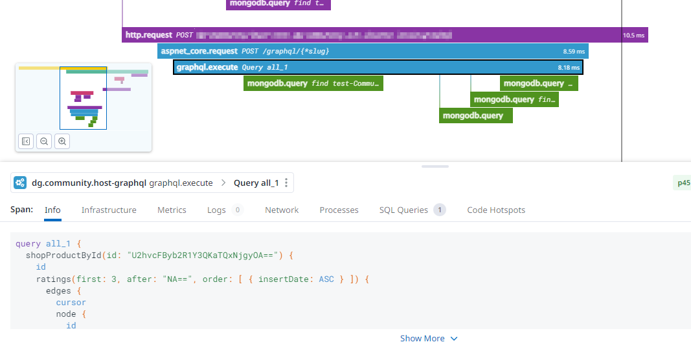

# GraphQlInstrumentationRepro

## Issue

There are currently two issues that prevent the
[auto instrumentation](https://github.com/DataDog/dd-trace-dotnet/tree/master/tracer/src/Datadog.Trace/ClrProfiler/AutoInstrumentation/GraphQL/HotChocolate)
for the Hot Chocolate GraphQL server to live up to its full potential.

1. The `graphql.execute` spans are using a different service name with the
   `-graphql` suffix. That can be a valid choice, but we'd prefer to have them
   attached to the same service that also handles "normal" HTTP API requests
   (`aspnet_core.request`) and be able to easily switch between the two
   operation types on the same service. After all, the time spent within
   GraphQL calls is still within our core service (business logic) and not
   something external like a database or HTTP request to a 3rd party where it
   makes sense to have it show up in Datadog as a different service. We learned
   that we can override the name with `TracerSettings.SetServiceNameMappings`,
   but that alone doesn't help us because of the second issue.
2. The GraphQL spans have the `/graphql/{*slug}` HTTP span as a parent. This
   adds no useful information, and worse, prevents the real GraphQL span from
   being the service entry span for the request. So even if we can have
   `graphql.execute` show up in the service we want using the service name
   mappings, it's going to be treated as a second-class span by Datadog and for
   example not show up as a selectable operation type in the APM dropdown.

Both of these behaviors are visible in this trace.

Unless there is a better solution, we'd need a way to discard _only_ the
specific `aspnet_core.request` spans with requests to `/graphql/{*slug}`,
without losing the actual `graphql.execute` below.

## Reproduction

This repository is a minimal example of a Hot Chocolate GraphQL API using the
`Datadog.Trace` tracer.

1. Make sure you have some tooling on your machine that is able to collect traces from `Datadog.Trace` 2.23.0
2. Start the application with `dotnet run`
3. Send requests with
   `curl --location http://127.0.0.1:5212/graphql --header 'Content-Type: application/json' --data-raw '{"query": "query { hello }"}'` on Unix-like systems or
   `curl.exe --location http://127.0.0.1:5212/graphql --header 'Content-Type: application/json' --data-raw '{\"query\": \"query { hello }\"}'` on Windows/PowerShell

You should be able to observe both points described above.

## License

[MIT License](LICENSE)
